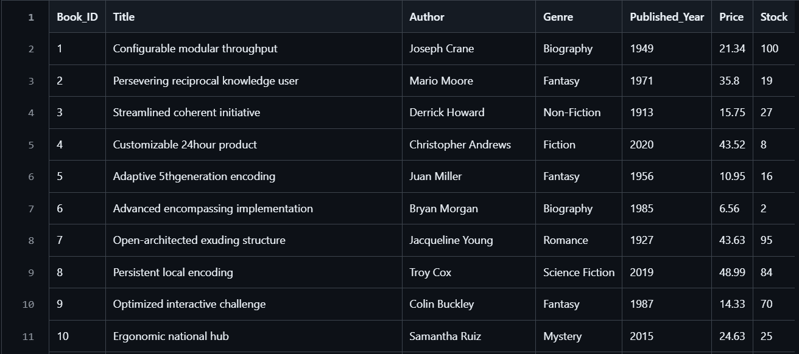
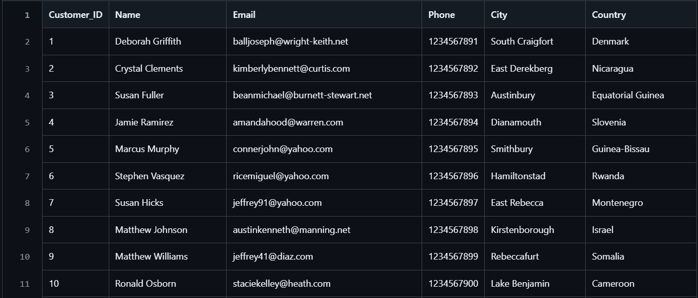
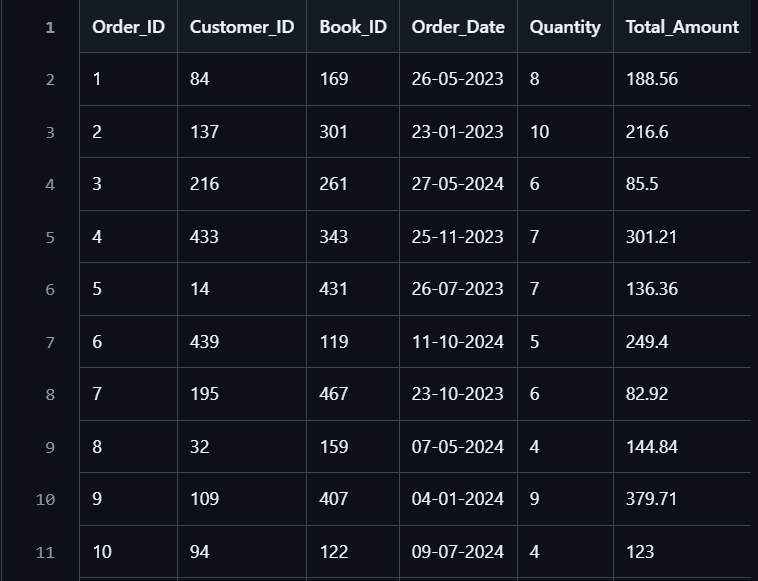

# Online Book Store Database System

## Overview

This project implements a relational database for an online bookstore using PostgreSQL. It manages data related to books, customers, and orders, and supports analytical queries to extract meaningful insights from transactional data.

---

## Database Schema

The system is built using three core tables:

### Books

Stores information about available books including title, author, genre, price, and stock.

### Customers

Contains customer details such as name, email, location, and contact information.

### Orders

Tracks purchase transactions including customer, book, order date, quantity, and total amount.

Relationships:

* Each order is linked to a customer (`Customer_ID`)
* Each order is linked to a book (`Book_ID`)

---

## Tech Stack

* PostgreSQL
* SQL

---

## Key Operations

### Database & Table Creation

* Created database `OnlineBookstore`
* Defined tables using appropriate data types
* Applied constraints:

  * Primary Keys
  * Foreign Keys for relationships

### Data Loading

* Imported data from CSV files using `COPY` command
* Loaded data into Books, Customers, and Orders tables

---

## SQL Analysis

The project includes multiple SQL queries to analyze business data:

### Basic Queries

* Filtering using `WHERE` (genre, country, year)
* Sorting using `ORDER BY`
* Limiting results using `LIMIT`
* Removing duplicates using `DISTINCT`

### Aggregations

* Total revenue calculation using `SUM`
* Average price using `AVG`
* Total stock calculation
* Books sold per genre and author

### Joins

* Combined data from multiple tables using `INNER JOIN`
* Example use cases:

  * Genre-wise sales
  * Customer order analysis
  * Book performance tracking

### Grouping & Conditions

* Used `GROUP BY` for category-level insights
* Applied `HAVING` to filter aggregated results
* Identified customers with multiple orders

### Advanced Queries

* Top-performing books and customers
* Most frequently ordered book
* Revenue by genre and author
* Stock remaining after fulfilling orders using `COALESCE`
* Customer spending analysis

---

## Key Insights

* Revenue can be calculated directly from order transactions
* Certain books and genres are ordered more frequently than others
* A small group of customers contributes higher total spending
* Stock levels can be tracked dynamically after orders
* Order quantity and total amount help identify high-value transactions

---

## Conclusion

This project demonstrates the use of SQL for database design, data management, and business analysis in an e-commerce environment. It covers core SQL concepts such as joins, aggregations, and data relationships applied to a real-world scenario.

## Database Preview

### Books Table

### Customers Table

### Orders Table

